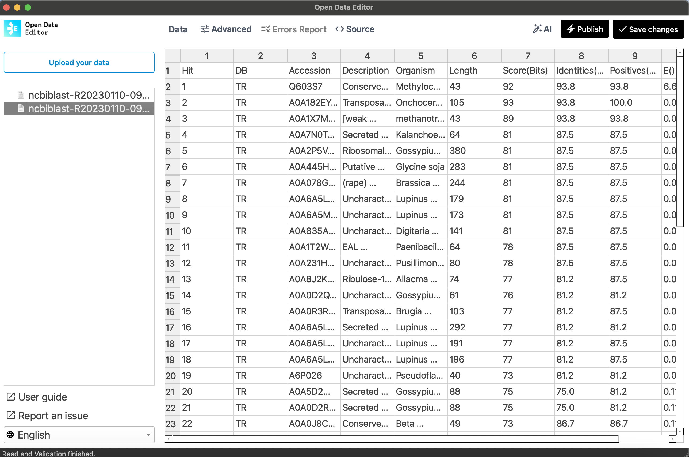
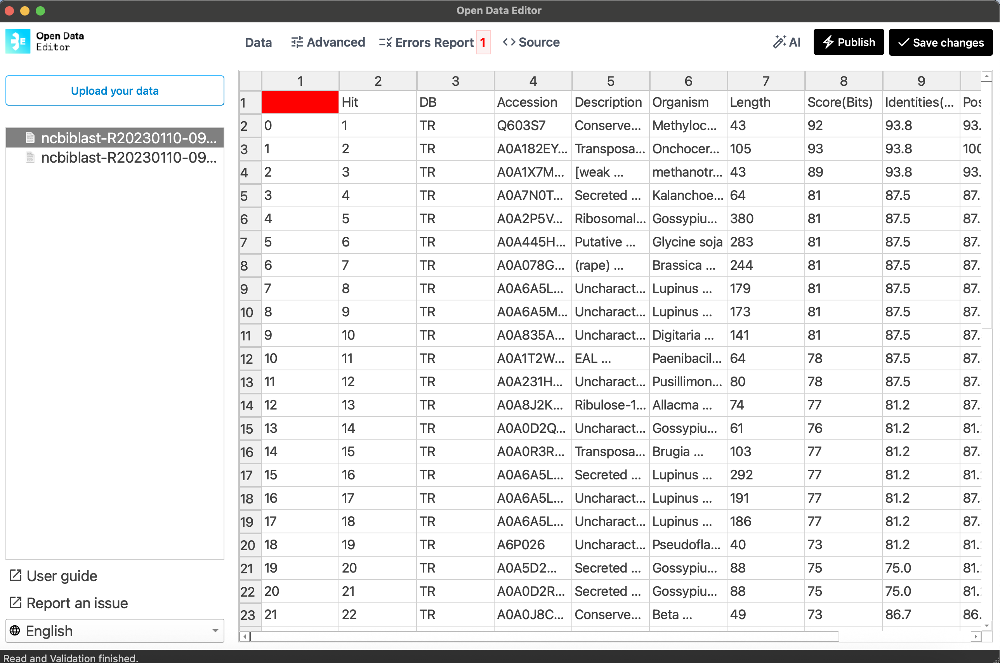
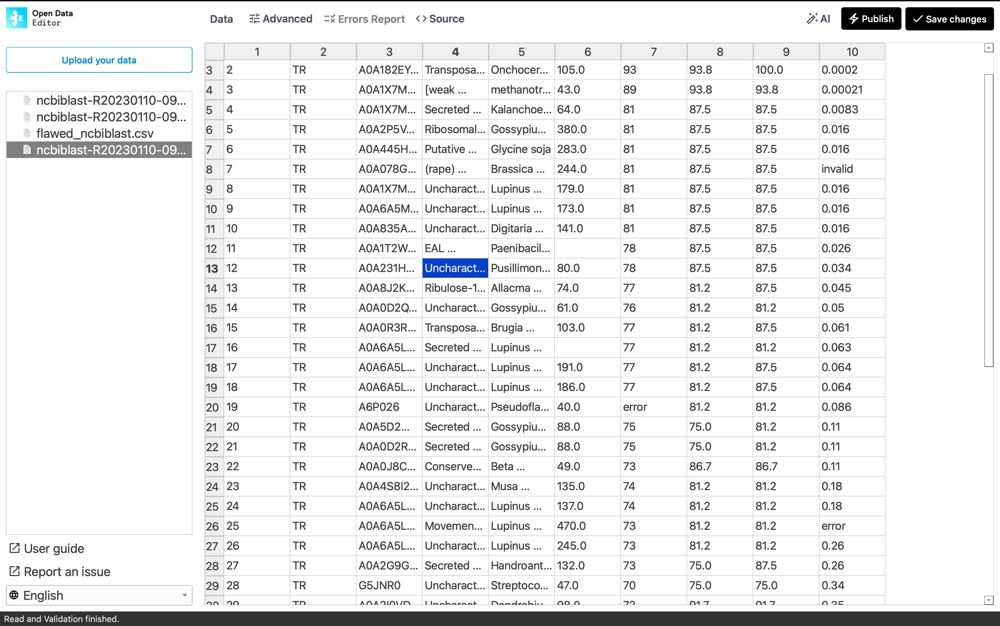

# Data Cleaning Project with Open Data Editor


## Project Description

This project demonstrates data cleaning techniques using Open Data Editor, focusing on NCBI BLAST results and pathogenic E. coli strain data. The project processes files generated by MEME to find motifs (taking only 6 characters into consideration) and evaluates the effectiveness of Open Data Editor in detecting and correcting various data quality issues.

Key objectives:
- Convert TSV files to CSV format for compatibility with Open Data Editor
- Test data validation capabilities by introducing controlled errors
- Analyze the limitations of automated error detection tools
- Demonstrate programmatic data cleaning approaches

Data sources: Files obtained from NCBI, BLAST and SRA projects. Related work: [Phylogenetics Project](https://github.com/Shuyib/Phylogenetic-tree-study)

## Installation

### Virtual Environment Setup
```bash
# Create and activate virtual environment
python3 -m venv .venv
source .venv/bin/activate

# Install dependencies
make install
```

### Alternative Installation with Make
```bash
# Detect available package managers (uv, pipenv, poetry)
make detect

# Install with automatic package manager detection
make install
```

### Manual Installation
```bash
pip install -r requirements.txt
```

## Data Processing Pipeline

### 1. TSV to CSV Conversion
The project includes pandas-based conversion from TSV to CSV format:

```python
import pandas as pd

# Read the TSV file
df = pd.read_csv('ncbiblast-R20230110-091221-0382-99758486-p1m_meme6.tsv', sep='\t')
# Save as CSV without index
df.to_csv('ncbiblast-R20230110-091221-0382-99758486-p1m_meme6.csv', index=False)
```

### 2. Error Introduction and Testing
The project includes scripts to introduce controlled errors for testing data validation:

```bash
python tidy_ncbiblast_enhanced.py ncbiblast-R20230110-091221-0382-99758486-p1m_meme6_with_errors.csv
```

## Data Quality Issues Addressed

The automated scripts detect and fix the following issues:

1. **Missing Values**: Gaps in numeric columns (Length, Score)
2. **Invalid E-values**: Non-numeric entries ('invalid', 'N/A', 'error', '---', 'null')
3. **Duplicate Accessions**: Repeated sequence identifiers
4. **Non-numeric Scores**: Invalid entries in Score(Bits) column  
5. **Oversized Descriptions**: Extremely long descriptions (>500 characters)
6. **Invalid Characters**: Unusual characters in organism names (@#$%)
7. **Column Formatting**: Non-standard column name formats

## Key Files

- `tidy_ncbiblast.py` - Basic data cleaning script
- `tidy_ncbiblast_enhanced.py` - Enhanced cleaning with error detection
- `fix_ncbi_blast_errors.py` - NCBI BLAST specific error corrections
- `fix_pathogenic_ecoli_errors.py` - E. coli strain data cleaning
- `requirements.txt` - Python dependencies
- `Makefile` - Automated build and testing commands

## Visual Results

**Before Data Cleaning:**


**After Data Cleaning:**


**Error Detection Limitations:**


## Running the Project

### Basic Usage
```bash
# Activate environment and run cleaning scripts
source .venv/bin/activate
python tidy_ncbiblast_enhanced.py [input_file.csv]
```

### Using Make Commands
```bash
# Format code and run linting
make format lint

# Run tests
make test

# Clean project directory
make clean
```

## Project Structure

```
open-data-editor/
├── ncbiblast-R20230110-091221-0382-99758486-p1m_meme6.csv
├── pathogenic_e_coli_30strains.csv
├── tidy_ncbiblast.py
├── tidy_ncbiblast_enhanced.py
├── fix_ncbi_blast_errors.py
├── fix_pathogenic_ecoli_errors.py
├── requirements.txt
├── Makefile
└── README.md
```

## Dataset Description

The datasets used in this project were obtained from public sources: NCBI, BLAST, and SRA projects. These datasets are publicly available and can be freely shared within the team.

**Example: ncbiblast-R20230110-091221-0382-99758486-p1m_meme6.csv**

- **Shape:** 49 rows × 10 columns (with errors introduced; original shape may vary)
- **Columns:**
  - `Accession` (string): Sequence identifier
  - `Description` (string): Sequence description
  - `Organism` (string): Organism name
  - `Length` (integer): Sequence length
  - `Score(Bits)` (float): BLAST score
  - `E-value` (float): Statistical significance
  - ...other columns depending on file...

Sample row:
| Accession | Description | Organism | Length | Score(Bits) | E-value |
|-----------|-------------|----------|--------|-------------|---------|
| ABC12345  | hypothetical protein | Escherichia coli | 350 | 42.7 | 1e-10 |

**Example: pathogenic_e_coli_30strains.csv**

- **Shape:** 30 rows × 5 columns
- **Columns:**
  - `strain_name` (string): Name of the E. coli strain
  - `pathogenic_type` (string): Pathotype classification
  - `infection_type` (string): Clinical infection type
  - `pathogenesis_mechanisms` (string): Mechanisms of pathogenesis
  - `reference_or_ncbi_id` (string): Reference or NCBI Taxonomy ID

Sample row:
| strain_name | pathogenic_type | infection_type | pathogenesis_mechanisms | reference_or_ncbi_id |
|-------------|----------------|---------------|------------------------|----------------------|
| Escherichia coli O157:H7 str. EDL933 | EHEC (STEC) | Hemorrhagic colitis; hemolytic uremic syndrome | Shiga toxins 1 & 2; LEE-encoded T3SS (intimin/Tir) causing attaching–effacing (A/E) lesions | TaxID 155864 |

## Use of Open Data Editor (ODE)

We used the Open Data Editor tool to visually inspect and validate the cleaned datasets. The main goal was to determine if ODE could automatically detect common data quality issues (such as missing values, invalid entries, and duplicates) that were intentionally introduced for testing.

## Limitations and Bugs

While ODE provided a user-friendly interface for browsing and editing data, it was unable to automatically detect several types of errors (see screenshots below). This highlighted the need for programmatic validation and cleaning scripts.

## Project Impact

Using ODE in combination with automated scripts improved our understanding of data quality challenges. While ODE was helpful for manual inspection, the automated scripts were essential for reliably detecting and correcting subtle errors. This workflow has streamlined our data cleaning process and improved the reliability of downstream analyses.

## Additional Notes

- The Open Data Editor interface did not detect the intentionally introduced errors, highlighting the importance of programmatic data validation
- Multiple package managers are supported (uv, pipenv, poetry) with automatic detection
- The project demonstrates both basic and enhanced data cleaning approaches
- All scripts include comprehensive error logging and reporting

## Contributing

1. Fork the repository
2. Create a feature branch (`git checkout -b feature/improvement`)
3. Make your changes and test them
4. Run linting and formatting (`make format lint`)
5. Submit a pull request

## License

This project is licensed under the MIT License - see the LICENSE file for details.
